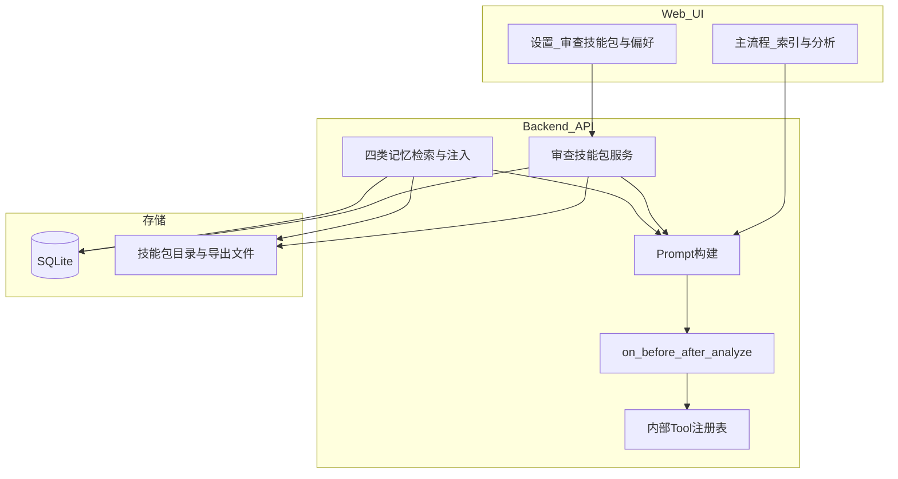
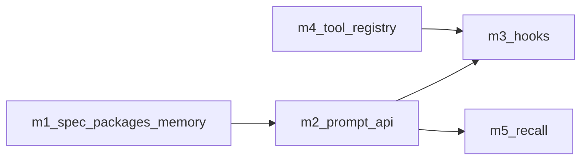

# AI-KA 架构改善建议（含执行计划）

本文档为 **架构方向 + 执行落地** 的统一入口：前半部分归纳本轮架构改善建议（与 Claude Code 等成熟 Agent 形态对照）；后半部分 **完整收录**「审查技能包」迁移与 m1–m6 里程碑（原 [`AI-KA_改进计划.md`](AI-KA_改进计划.md) 正文），实施时以 **本文件「执行计划」起各节** 为审查技能包相关改动的依据。

---

## 架构层：目标形态与分层

### 目标

- **可演进**：审查域配置（审查技能包）、记忆、工具、钩子可独立版本化，避免「单一大文件 rules」阻塞迭代。  
- **可审计**：每次分析可追溯 `skill_package_id`、`package_version_hash`、注入的记忆片段来源、钩子与内部 Tool 调用记录。  
- **可约束**：用户可配置部分（审查技能包、项目记忆）与 **平台内置策略**（安全、输出契约、隐私）分层，后者不可被覆盖。  
- **可测试**：大改动由自动化与冒烟门禁兜底（见执行计划第 8 节）。

### 逻辑分层（建议）

### 与 Claude Code 的可借鉴点（摘要）

| 领域 | 借鉴意图 |
|------|----------|
| **会话与消息边界** | 区分持久化 transcript 与 ephemeral 进度，保证回放与审计一致。 |
| **Tool 抽象** | 校验器、指标脚本等走统一注册、权限与日志，避免散落 `subprocess`。 |
| **Skill / 审查技能包** | 可装载单元带 manifest；审查域以「包」为粒度切换与版本管理。 |
| **Memory** | 多类记忆 + 相关性检索 + `already_surfaced` 去重 + 注入上限。 |
| **Permission / 钩子** | 危险或副作用操作经队列/钩子决策；分析前后钩子便于审计与扩展。 |

### 与「执行计划」的关系

- **审查技能包**替换旧「根目录单文件 rules」管线、**m1–m6 里程碑、测试门禁** 等均在下文 **「执行计划」** 中展开；架构层不重复细则，仅保证方向一致。  
- 若与 [`ProjectLens_详细设计_V1.1.md`](ProjectLens_详细设计_V1.1.md) 等旧文档冲突，**以本文件执行计划章节为优先**，落地后再回写详细设计。

---

## 执行计划（审查技能包 · 执行稿）

> 以下章节原载于 `docs/AI-KA_改进计划.md`，作为审查技能包迁移与质量门禁的完整规格。

本文档为当前阶段的产品/技术改进基线，用语已对齐为 **「审查技能包」**，不再以「活动规则 / 根目录单文件 rules」作为对外主概念（实现层可保留极少量过渡常量名，文档与 UI 一律用审查技能包）。

### 文档定位：以哪份为准？

| 文档                                                                                                                    | 角色                                                                       |
| --------------------------------------------------------------------------------------------------------------------- | ------------------------------------------------------------------------ |
| **本文件中的「执行计划」章节 + 本架构文档整体**                                                                                    | **本阶段改进的单一事实来源（SSOT）**：审查技能包迁移、prompt/记忆/钩子/工具里程碑、验收与测试门禁均以本文为准。 |
| 对话或 IDE 中的「架构改善建议 / Claude 借鉴」类草稿                                                                                     | **背景与启发**；已收敛至本文件「架构层」与「执行计划」。 |
| [`ProjectLens_需求与设计文档_V1.0.md`](ProjectLens_需求与设计文档_V1.0.md)、[`ProjectLens_详细设计_V1.1.md`](ProjectLens_详细设计_V1.1.md) 等 | **产品/模块既有规格与历史架构**；与本执行稿冲突时，**以本改进计划为优先**（改进完成后可再回写详细设计）。                |
| [`ProjectLens_行动计划_V1.0.md`](ProjectLens_行动计划_V1.0.md)                                                                | 较早行动计划；与本篇范围重叠时 **以本篇为准**。                                               |

**结论**：实施与评审「改动量很大的这一轮」时，**请跟踪本文件**（架构层 + 执行计划）；[`AI-KA_改进计划.md`](AI-KA_改进计划.md) 仅保留简短入口，避免长文双处维护。

---

### 1. 术语对齐（全局）

| 原表述（废弃用于对外/计划）                               | 现统一表述                                     |
| -------------------------------------------- | ----------------------------------------- |
| 活动规则文件（根目录单文件 rules）、`AIKA_RULES_FILENAME`（语义上） | **审查技能包**（可版本化、可切换的审查域配置单元）               |
| 关注点 / focus 块（仍保留技术名 `focus` 亦可）             | **审查技能包**内的 **关注点定义**（或子资源「关注点」）          |
| 组合使用建议 / 预设                                  | **预设组合**（隶属某一审查技能包或跨包引用，以实现为准）            |
| Rules → Skill 迁移                             | **规则形态内容 → 审查技能包** 迁移（不再保留旧根目录 rules 单文件兼容） |

**说明**：「平台安全策略 / 输出 JSON 契约」等不可被用户覆盖的约束，不称为审查技能包，称为 **平台内置策略**（单独一条注入链，与审查技能包并列，优先级更高）。

---

### 2. 「rules → 审查技能包」迁移路径（明确、无双读）

#### 2.1 原则

- **不兼容** 既有「单文件 Markdown 即唯一真相源」的根目录 rules 管线：不再支持从根目录单一文件读入并驱动全站。
- **无双读期**：不实现「同时写旧文件 + 新技能包」；一次性切到审查技能包存储与 API。
- **迁移源**仅作为 **内容搬运与拆分参考**，迁移完成后以 **审查技能包目录/数据库记录** 为唯一真相：
  - 历史根目录 rules / `default_rules.md` 已弃用；默认迁移源为仓库根 [`default_skills.md`](../default_skills.md)
  - （已迁移完毕）历史的 `rules_new.md` / `rules_new2.md`：不再保留在仓库根目录，内容应以对应技能包为准

#### 2.2 目标形态（逻辑结构）

每个 **审查技能包** 至少包含：

- **清单（manifest）**：`id`、`display_name`、`version`、`schema_version`、可选 `description`。
- **关注点集合**：与当前 `### focus:...` 块对等的结构化条目（解析后入库或拆分为子文件均可）。
- **预设组合**：对应原「组合使用建议」/ 设置页中的预设；与 `chunk_strategy`、`llm_settings` 等关系以保持现有产品行为为准，迁入设置或包级默认值。
- **可选：包级元数据**：如适用场景标签（一审/二审/通用）、来源备注（由哪一迁移源生成）。

存储形态可为 **仓库内目录**（例如 `review_skill_packages/<package_id>/`）+ **SQLite 索引/缓存**，以详细设计为准；关键是 **API 与 UI 只认「当前选中的审查技能包」**，不再认 `AIKA_RULES_FILENAME` 指向单文件。

#### 2.3 迁移源 → 审查技能包（建议拆分）

以下为 **建议包划分**（实施时可微调命名，但需在迁移脚本/文档中固定）：

1. **`package-general`**（自 `default_skills.md` 或历史迁移文件）
  - 内容特征：通用维度（如需求完整性、风险、集成、范围蔓延等）。  
  - 产出：一个审查技能包，内含全部通用关注点与对应预设组合（从原表格/设置推导）。
2. **`package-solution-review-fs-v1`**（原内容来自历史的 `rules_new.md`）
  - 内容特征：方案一审/二审大块、步骤化评审体系（当前文件最长）。  
  - 产出：一个审查技能包；若单包过大，可 **拆成** `package-first-review` + `package-second-review` 两个包，由预设组合分别引用（仍属一次性迁移，无双读）。
3. **`package-solution-review-fs-v2`**（原内容来自历史的 `rules_new2.md`）
  - 内容特征：与历史的 `rules_new.md` 同域、表述/结构略有差异（可视为另一版本线）。  
  - 产出：独立审查技能包，便于 A/B 或按客户选用；**不与 v1 自动合并**，避免丢失差异。

迁移步骤（实施 checklist）：

1. 定义 manifest schema 与关注点解析规则（从现有 `### focus:` 语法迁移到结构化存储）。
2. 为上述每个包生成目录或 DB 记录，并 **人工 spot-check** 关注点数量与预设与源文件一致。
3. 删除或弃用：根目录单一规则文件读写路径、仅校验旧根目录 rules 的导入接口（改为 **审查技能包导入/校验**）。
4. 更新设置页、系统管理文档：仅描述 **审查技能包** 的加载、切换、导入。
5. **跳过双读期**：上线即仅读写新模型。

#### 2.4 环境变量与配置

- 废弃以 **`AIKA_RULES_FILENAME`** 切换「唯一规则文件」的用户心智；改为例如 **`AIKA_REVIEW_SKILL_PACKAGES_ROOT`**（包根目录）+ **应用内当前默认包 id**（或 `app_settings` / DB）。  
- 具体变量名以实现为准，计划层只约束：**不再存在「单文件 rules = 主配置」模型**。

---

### 3. 数据库策略（开发阶段）

- 当前为开发期，**允许清空 SQLite / 大幅改 schema**，无遗留生产数据约束。  
- 若引入 `review_skill_package`、`focus_point`、`preset` 等表，可直接 **DROP 重建** 或提供一次性 **空库初始化**，不必为旧 `rules` 表写复杂迁移。  
- 与审查会话、导出路径相关的表若与新模型冲突，一并按新 schema 重建并 **丢弃测试数据**。

---

### 4. 与 Claude Code 借鉴点对齐（简表）

- **工具化**：指标脚本、校验器等注册为内部 Tool，统一权限与日志。  
- **记忆四类**：项目 / 用户 / 会话 / 平台；注入上限与去重（`already_surfaced`）。  
- **钩子**：`on_before_analyze` / `on_after_analyze` 审计与扩展。  
- **提示构建**：记录 `skill_package_id`、`rules_hash` 的继任字段（如 `package_version_hash`）、注入片段来源。

---

### 5. 里程碑任务（与 TODO 对齐）

| ID                   | 内容                                                                                                                                 |
| -------------------- | ---------------------------------------------------------------------------------------------------------------------------------- |
| **m1-spec**          | 定稿审查技能包 **Manifest**、四类 memory 目录与索引格式、注入上限与隐私红线（文档+示例）。                                                                           |
| **m2-prompt-api**    | 扩展 prompt 构建与设置 API：支持 `skill_meta`、`memory_snippets`；运行元数据记录 `skill_package_id` / `package_version_hash`（取代仅 `rules_hash` 的单一语义）。 |
| **m3-hooks**         | 实现 `on_before_analyze` / `on_after_analyze` 钩子注册与内置审计。                                                                             |
| **m4-tool-registry** | 内部 Tool 注册表：规则校验、可选指标脚本，统一权限与日志。                                                                                                   |
| **m5-recall**        | 记忆相关性检索与 `already_surfaced` 去重。                                                                                                    |
| **m6-test-gate**     | 测试与质量门禁（见第 8 节）：改动合并前必须通过约定自动化与冒烟清单。                                                                                               |

---

### 6. 依赖关系建议

---

### 7. 验收要点（迁移完成后）

- 设置页仅出现 **审查技能包** 相关文案与路径提示。  
- 三个迁移源中的关注点与预设可在目标包中 **逐条对应** 可追溯（清单或脚本校验）。  
- 无代码路径再 **依赖根目录 rules 单文件** 作为唯一配置源。
- 新克隆仓库 + 空库可 **一键初始化** 默认审查技能包（可由 `default_skills.md` 与选定方案评审包组合而成，以实现为准）。

---

### 8. 测试与质量兜底（大改动必配）

本阶段改动面大，**不以「手点一遍」为唯一保障**。合并前至少满足下列门禁；具体命令以仓库 `README` / CI 为准，此处为 **必达项清单**。

#### 8.1 自动化（门禁）

- **后端**：`pytest` 全量通过；对审查技能包解析、prompt 构建、设置读写、outputs 索引等 **变更模块补充或更新单测**；目标覆盖率 **不低于现有基线**（若基线低于 80%，本阶段相关包优先补到 ≥80%，与用户 TDD 规则一致）。  
- **前端**：`npm run build` 无错误；对设置页、会话回放、分析流等 **改动组件** 做最小必要的单测或 Story（若项目已接 Vitest/RTL）。  
- **静态检查**：Python `flake8`（或仓库既定 linter）通过；TS/ESLint 与类型检查通过。

#### 8.2 契约与迁移校验

- **API**：OpenAPI 或与前端共用的请求/响应类型 **与实现一致**；审查技能包相关 endpoint 变更需 **契约测试** 或快照测试。  
- **迁移**：从三份迁移源生成的包，提供 **脚本或单测** 校验「关注点数量 / id / 预设条目」与约定一致，避免手工遗漏。

#### 8.3 冒烟场景（可半自动）

在干净库 + 默认初始化数据上至少验证：

1. 选择审查技能包（或默认包）后，能完成 **索引 → 流式分析** 全流程无 500。
2. **设置页** 加载、保存、导入/校验（新语义下）可用。
3. **历史会话回放**：选中会话后主区能展示结果（与现有 `conversation_outputs` 行为一致或按新 schema 等价）。
4. **独立窗口**（帮助/设置，若仍保留）打开与关闭无异常。

#### 8.4 回归范围说明

- 数据库清空/重建 **不豁免** 第 8 节；反而应增加「空库初始化 → 冒烟」路径，避免初始化脚本腐烂。

---

*文档版本：与「rules → 审查技能包」无兼容、无双读、可清空数据库 决策同步；架构层与执行计划合并于本文件。*
